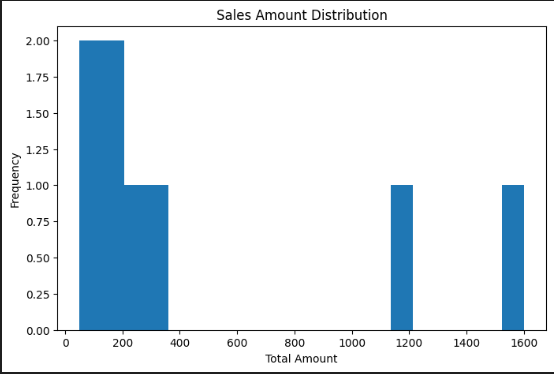
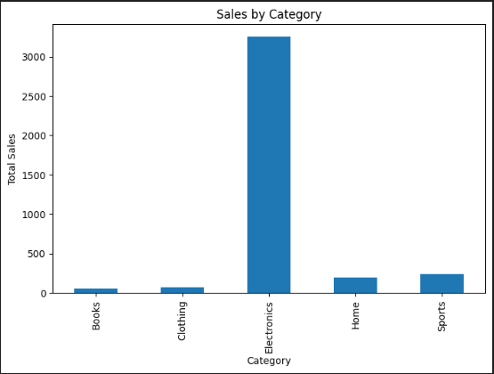
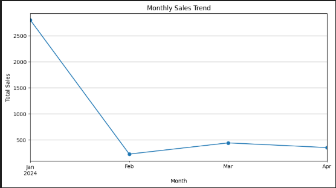
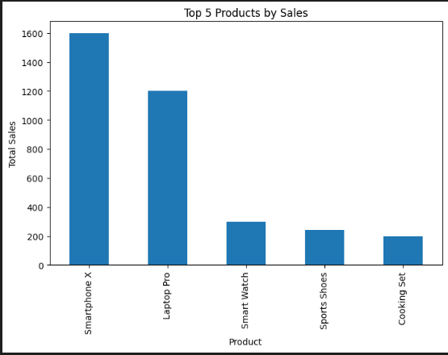

# 📊 Sales Data Analysis Dashboard  
### Week 7 – Data Analysis with Pandas

---

## 📌 Project Overview
The **Sales Data Analysis Dashboard** is an advanced-level data analytics project developed using **Python and Pandas**.  
The project analyzes real-world sales data to extract actionable business insights through **data cleaning, exploratory data analysis (EDA), statistical analysis, visualization, and reporting**.

This project demonstrates industry-standard practices used in **data analysis, business intelligence, and software engineering workflows**.

---

## 🎯 Project Objectives
- Load and analyze sales data from CSV files  
- Clean and preprocess raw datasets (missing values, duplicates, data types)  
- Perform exploratory and advanced data analysis  
- Identify key sales trends, top products, and categories  
- Generate visual insights using charts and graphs  
- Export analysis results into professional Excel reports  
- Maintain a modular, scalable, and well-documented codebase  

---

## 🧠 Key Concepts Covered
- Introduction to Data Analysis  
- Pandas DataFrames & Series  
- Data Cleaning and Preprocessing  
- Filtering, Grouping, and Aggregation  
- Statistical Metrics (Mean, Median, Growth Rate)  
- Time-Series Analysis (Monthly Trends)  
- Data Visualization using Matplotlib  
- Report Generation and Documentation  

---

## 🛠️ Technologies & Libraries Used
- **Python 3**
- **Pandas** – Data manipulation and analysis  
- **NumPy** – Numerical computations  
- **Matplotlib** – Data visualization  
- **OpenPyXL** – Excel file support  
- **Jupyter Notebook** – Interactive data analysis  

---

## 📂 Project Structure
```

week7-sales-analysis/
│
├── sales_analyzer/
│   ├── data_loader.py
│   ├── data_cleaner.py
│   ├── analyzer.py
│   ├── visualizer.py
│   └── reporter.py
│
├── data/
│   ├── raw/
│   ├── processed/
│   └── reports/
│
├── notebooks/
│   ├── exploration.ipynb
│   └── analysis.ipynb
│
├── images/
│   ├── top_5_product.png
│   ├── monthly_sale_trends.png
│   ├── sales_amount_distribution.png
│   └── sales_by_category.png
│
├── output/
├── tests/
├── main.py
├── requirements.txt
└── README.md

````

---

## ⚙️ Installation & Setup

### 1️⃣ Install Required Libraries
```bash
pip install -r requirements.txt
````

### 2️⃣ Run the Project

```bash
python main.py
```

### 3️⃣ Run Jupyter Notebooks (Optional)

```bash
jupyter notebook
```

---

## 📈 Features & Functionalities

✔ Load sales data from CSV files
✔ Automated data cleaning and preprocessing
✔ Exploratory Data Analysis (EDA)
✔ Monthly sales trend and growth analysis
✔ Category-wise and product-wise performance
✔ Professional data visualizations
✔ Excel-based reporting
✔ Modular and reusable code architecture

---

## 📊 Sample Insights Generated

* Total Sales and Average Order Value
* Monthly Sales Trends and Growth Rate
* Top Performing Product Categories
* Top-Selling Products
* Customer Purchase Behavior

---

## 📓 Jupyter Notebook Analysis & Visualizations

The project includes **Exploratory Data Analysis (EDA)** and **Advanced Analysis** using Jupyter Notebooks.
Below are screenshots demonstrating data analysis, visualizations, and outputs.

---

### 🔍 Exploratory Data Analysis (`exploration.ipynb`)

#### Sales Amount Distribution



#### Category-wise Sales Visualization



📌 *This notebook focuses on understanding dataset structure, sales distribution, and category-level insights.*

---

### 📈 Advanced Sales Analysis (`analysis.ipynb`)

#### Monthly Sales Trend



#### Top 5 Products by Sales



📌 *This notebook performs time-series analysis, growth calculation, and product performance evaluation.*

---

## 📤 Output Generated

* 📁 Cleaned and processed datasets
* 📊 Graphs and charts (PNG format)
* 📄 Excel sales analysis report
* 📘 Jupyter Notebook analysis

---

## 🎓 Learning Outcomes

* Strong understanding of Pandas for real-world data analysis
* Ability to clean and analyze business datasets
* Experience with data-driven decision-making
* Professional data visualization techniques
* Industry-ready project structuring and documentation

---

## 👩‍💻 Author Information

**Mehak Tewari**
**Specialization:** AI & ML | Full Stack Development | Software Engineering

📧 **Email:** [mehaktewari07@gmail.com](mailto:mehaktewari07@gmail.com)
🔗 **LinkedIn:**
[https://www.linkedin.com/in/mehak-tewari-04934b247/?originalSubdomain=in](https://www.linkedin.com/in/mehak-tewari-04934b247/?originalSubdomain=in)

---

## ✅ Submission Notes

This project satisfies all **Week 7: Data Analysis with Pandas** requirements and follows professional standards suitable for academic evaluation, technical interviews, and portfolio presentation.

```

---
